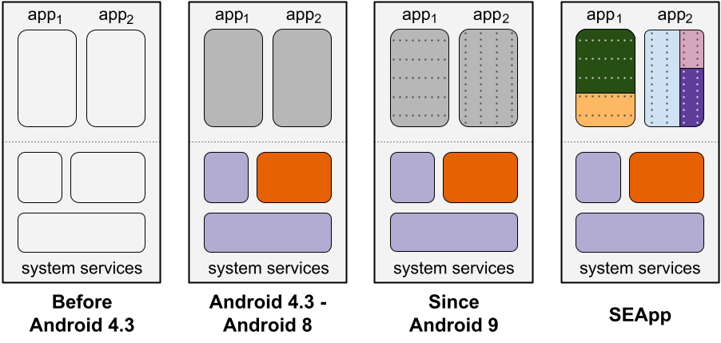

In [Android](https://source.android.com/index.html) è stato introdotto ormai
da tempo il supporto a Mandatory Access Control (MAC) per proteggere le app,
estendendo così la precedente protezione che contava solo su Android
Permissions (AP) e Discretionary Access Control (DAC).

Per poter usufruire delle sue proprietà di sicurezza addizionali ogni risorsa
di Android è associata ad un'etichetta.

Idealmente ogni etichetta associata ad un processo dovrebbe possedere il set
minimo di permessi necessari al corretto funzionamento del processo (principio
del privilegio minimo).

Tuttavia, in Android, tutte le app di terze parti sono associate alla
medesima etichetta *untrusted_app*, alla quale di conseguenza vengono associati
tutti i privilegi di cui un'app può necessitare.
Un'app normalmente necessita solo di un sottoset di quei privilegi, ma
nonostante questo viene associata ad una etichetta molto più permissiva che
permette a tutte le app operazioni quali l’invio/ricezione di SMS e chiamate,
lo storage di files, l’utilizzo della posizione geografica...

Per impedire alle applicazioni di effettuare operazioni non permesse,
subentrano gli strati più alti del controllo: AP e DAC.

Questo è un brutto esempio di defense in-depth, in quanto lo strato superiore
risulta più restrittivo di quello inferiore e peraltro viola anche il
principio del privilegio minimo.

SEApp risolve questi problemi fornendo agli sviluppatori la possibilità
di definire policy ad-hoc per la propria app, quindi supportando la
compartimentalizzazione dei componenti interni dell'app.

La seguente immagine mostra l'evolutione dell'uso di MAC all'interno di
Android e il miglioramento introdotto da SEApp.

----

### PREREQUISITI

* Buona conoscenza di C/C++ e Java

* Aver letto e compreso le sezioni Start, Download e Build della guida
  di Android Open Source Project (AOSP)

* Aver provato a compilare un sistema Android seguendo i passi descritti in
  tale guida e preferibilmente averlo provato su un dispositivo (anche
  virtuale) per verificare il successo dell’operazione

* Conoscenza (base) dei principi di funzionamento di SELinux

* *[Consigliato]* Esperienza di lavoro su grandi code base

----

### MATERIALE

* Android Open Source Project:
  [https://source.android.com/setup](https://source.android.com/setup)

* SEApp: Bringing MAC to Android Apps:
  (link al nostro paper presto disponibile)

* "SEApp: Bringing MAC to Android Apps" GitHub repository:
  [https://github.com/matthewrossi/seapp](https://github.com/matthewrossi/seapp)

----

### PROGETTI DI TESI

* **_[Magistrale]_** Porting di SEApp a versioni più recenti di Android (e.g.,
  11 e 12).

* **_[Magistrale]_** Controllare l'accesso all'external storage

  Da Android 10 alle app viene concesso un accesso limitato all'external
  storage.
  Mentre le app possono accedere liberamente ai file presenti all'interno della
  propria directory dedicata e ai media file di sua proprietà, ci sono
  molteplici restrizioni per quanto riguarda la condivisione, l'accesso e la
  modifica di file altrui.
  Attualmente queste limitazioni non sono garantite mediante l'uso di SELinux.

  L'obiettivo di questa tesi è estendere SEApp per controllare l'accesso
  all'external storage dedicato alle app mediante l'uso di contesti SELinux.

* **_[Magistrale]_** Transizione di dominio a seguito di exec()

  Da Android 10 invocare exec() su file scrivibili dall'app è una violazione di
  [W^X](https://en.wikipedia.org/wiki/W%5EX) e rappresenta quindi una pratica
  ritenuta pericolosa. Il codice eseguibile dovrebbe sempre essere caricato
  dall'APK dell'app.
  
  Mentre l'exec() non funziona più su file interni alla home directory
  dell'app, continua ad essere supportata su file che si trovano all'interno
  della directory /data/app.

  L'obiettivo di questa tesi è estendere SEApp al fine di supportare un cambio
  di dominio SELinux a seguito dell'esecuzione di codice nativo mediante exec()
  che si trova all'interno di /data/app.